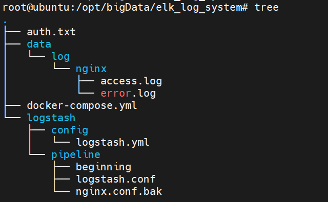
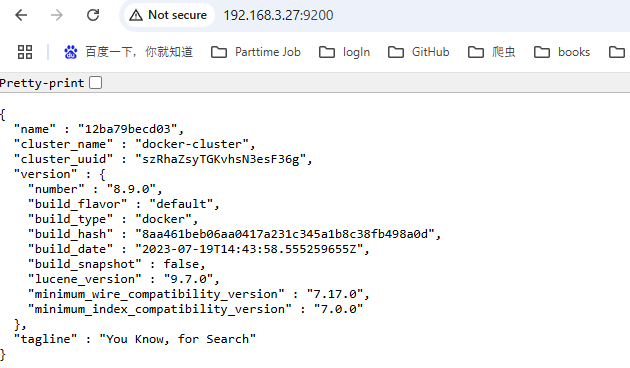
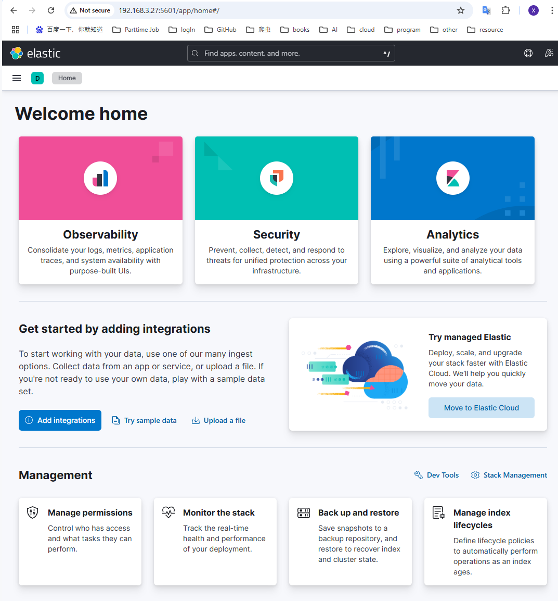
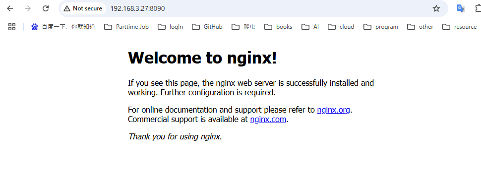
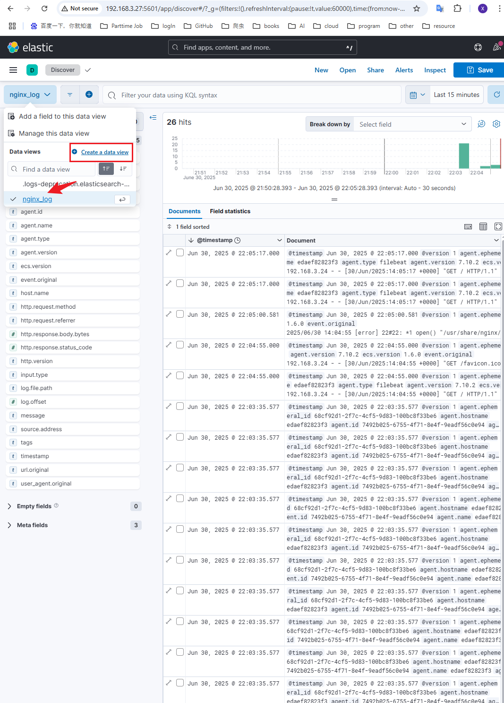

# 基于docker搭建elk监控nginx日志

It's the record of big data practice process
elk:8.9.0 nginx:latest
IP:192.168.3.27
## 一、 Docker
### 1、 前置条件
服务器上已经安装好docker
images 分别如下
```agsl
root@ubuntu:/opt/bigData/elk_log_system# docker images |grep 8.9.0
elasticsearch                                               8.9.0                  281908e9f34e   23 months ago   1.34GB
kibana                                                      8.9.0                  b3f165bc5f9b   23 months ago   886MB
logstash                                                    8.9.0                  3b71b698e0ae   23 months ago   758MB
```

### 2、 文件层级


按照文件层级图，配置好docker-compose.yml, logstash.yml, logstash.conf，项目中不存在文件跳过

### 3、 docker启动elk
```agsl
docker-compose up -d
```
观察elk是否正常启动，若kibana未正常启动，通过docker logs kibana观察日志

### 4、 验证elk界面是否正常
登录elasticsearch
使用elastic账号密码登录，账号生成参考
```/usr/share/elasticsearch/bin/elasticsearch-setup-passwords interactive```


登录kibana，页面如下：

##### 注： docker-compose中，ELASTICSEARCH_SERVICEACCOUNTTAKEN（kibana需要该TAKEN）可以先不填，启动elk后，生成后填入，生成指令如下
```agsl
curl -XPOST -u elastic:${pwd} \
"http://${IP}:9200/_security/api_key" \
-H "Content-Type: application/json" \
-d'{
  "name": "service_account_key",
  "role_descriptors": {
    "service_account_role": {
      "cluster": ["monitor"],
      "indices": [{
        "names": ["logs-*"],
        "privileges": ["read"]
      }]
    }
  }
}'
```

## 二、 启动nginx
### 1、 拉取镜像
docker pull nginx

### 2、 启动镜像
命令如下：
-p：映射端口
-v：挂载地址映射
docker run --name nginx -p 8090:80 -v /opt/bigData/elk_log_system/data/log/nginx:/var/log/nginx/ -d nginx

### 3、正常访问nginx
访问端口号8090，并显示正常

`

## 三、 elk监控nginx日志
### 1、 filebeat安装与配置
filebeat安装
```agsl
# download filebeat
# Debian/Ubuntu
curl -L -O https://artifacts.elastic.co/downloads/beats/filebeat/filebeat-7.10.2-amd64.deb
dpkg -i filebeat-7.10.2-amd64.deb
```
配置filebeat
```agsl
cat << EOF > /etc/filebeat/filebeat.yml
filebeat.inputs:
  - type: log
    enabled: true
    paths:
      - /var/log/nginx/access.log  # Nginx 访问日志路径
      - /var/log/nginx/error.log   # Nginx 错误日志路径

output.logstash:
  hosts: ["192.168.3.27:5044"]
EOF
```

### 2、 启动filebeat
service filebeat start

### 3、 监控nginx日志
登录kibana页面，discover页面
create a new data view 选择nginx日志创建data view
