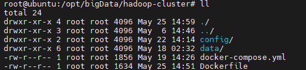
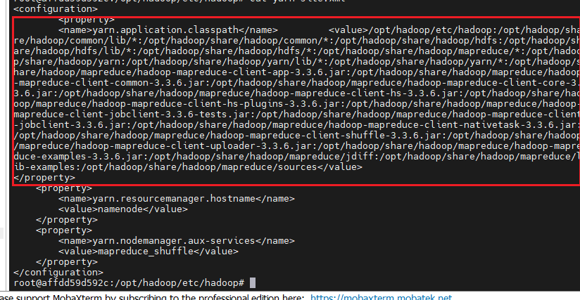

# 大数据wordCount流程（基于docker hadoop实现）

It's the record of big data practice process
JAVA 8 + hadoop 2.7.4
## 一、 代码实现
### 1、 Mapper实现
文字分离
mapper实现，key value返回

eg: *context.write(keyOut, valueOut);*

context 为org.apache.hadoop.mapreduce.Mapper.Context对象

### 2、 Reduce实现
统计计数，合并key，key value返回

eg: *context.write(key, valueOut);*

context 为org.apache.hadoop.mapreduce.Reducer.Context对象

### 3、 设置Job规则
初始化Job
设置Job启动类，Mapper，Reducer
设置输入输出文件路径
提交等待任务完成

## 二、 cluster docker执行任务
### 1、 构建自定义镜像
创建工作目录，自定义hadoop集群镜像
Dockerfile以及config路径如下
wordCount/src/main/resources/hadoopProcess/clusterResource/
在工作目录下存放config配置


执行如下指令构建自定义镜像 
```
docker build -t hadoop-custom .
```

### 2、 搭建集群--docker compose
构建docker-compose.yml文件
文件地址: wordCount/src/main/resources/hadoopProcess/clusterResource/docker-compose.yml
启动集群:
```
docekr-compose up -d
```

### 3、 启动HDFS
进入主节点
```
docker exec -it namenode bash
```
启动hdfs，yarn配置----namenode
```
bash /opt/hadoop/sbin/start-dfs.sh
bash /opt/hadoop/sbin/start-yarn.sh
```

启动dataNode,dataManager服务----datanode*
```
hdfs --daemon start datanode
yarn --daemon start nodemanager
```

### 执行wordCount大数据程序
上传输入文件至HDFS中，输入文件可以使用python脚本(src/main/resources/generateWords.py)
```
# 创建HDFS输入目录（如果不存在）
hdfs dfs -mkdir -p /input
# 上传当前目录下所有json文件
hdfs dfs -put *.json /input/
# 验证上传结果
hdfs dfs -ls /input
```
执行jar程序，在jar目录下运行如下命令
```
hadoop jar wordCount-1.0-SNAPSHOT.jar \
org.leo.WordCountDriver \
/input \
/output
```

查看执行结果
```
hdfs dfs -cat /output/part-r-00000
```


**注：如果遇到如下错误**
```
[2025-05-22 14:56:31.571]Container exited with a non-zero exit code 1. Error file: prelaunch.err.
Last 4096 bytes of prelaunch.err :
Last 4096 bytes of stderr :
Error: Could not find or load main class org.apache.hadoop.mapreduce.v2.app.MRAppMaster
Please check whether your <HADOOP_HOME>/etc/hadoop/mapred-site.xml contains the below configuration:
<property>
<name>yarn.app.mapreduce.am.env</name>
<value>HADOOP_MAPRED_HOME=${full path of your hadoop distribution directory}</value>
</property>
<property>
<name>mapreduce.map.env</name>
<value>HADOOP_MAPRED_HOME=${full path of your hadoop distribution directory}</value>
</property>
<property>
<name>mapreduce.reduce.env</name>
<value>HADOOP_MAPRED_HOME=${full path of your hadoop distribution directory}</value>
</property>
```
可以通过如下方案解决:
查看hadoop classpath
```agsl
hadoop classpath
```
将输出内容导入yarn-site.xml文件中，对应的label为 <name>yarn.application.classpath</name>
